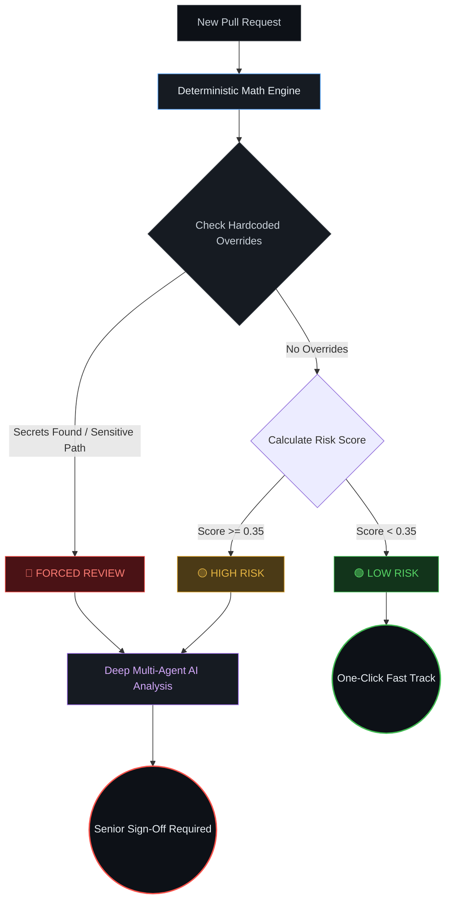

# DEMO REX REVIEW GATE

A local-first CLI and Streamlit dashboard that triages pull requests with **"Math Before AI"**.

Instead of running expensive, slow AI analysis on every single commit, REX uses deterministic Git-history mathematics to calculate the structural risk of a pull request in milliseconds. It only wakes up the expensive LLM agents when the math proves the code is actually dangerous.

---

## 🧠 Core Philosophy: Math Before AI



### 1. The Deterministic Math Engine (Cost: $0)
Before any AI is involved, REX intercepts the PR and calculates a strict blast-radius score using local `git diff` stats. The score is a weighted formula evaluating:
- **Test Delta (25%)**: Are tests being added/modified alongside code?
- **Blast Radius (25%)**: How many unique files and directories are touched?
- **Lines Modified (30%)**: Total churn size.
- **Change Entropy (10%)**: How scattered are the changes?
- **Defect Density (10%)**: Have these files historically caused bugs?

### 2. The Triage Gate
- **🟢 LOW RISK**: The math proves the PR is safe (e.g., documentation changes, simple CSS tweaks). It bypasses AI entirely and goes straight to the fast-track queue for a 1-click human approval.
- **🟡 HIGH RISK**: The math detects high structural risk or high complexity. REX wakes up the AI agents to do a deep dive.
- **🔴 FORCED REVIEW**: A hardcoded rule fired (e.g., regex caught an AWS key, or a sensitive `payments/` path was touched). Overrides all math. Merging is immediately blocked pending deep AI review and Senior sign-off.

---

## 🛠 Setup Instructions

### macOS / Linux
```bash
python3 -m venv .venv
source .venv/bin/activate
pip install -r requirements.txt
cp .env.example .env
```

### Windows
```cmd
python -m venv .venv
.venv\Scripts\activate
pip install -r requirements.txt
copy .env.example .env
```

## 🚀 Running the App
Start the dashboard locally:
```bash
streamlit run app.py
```
